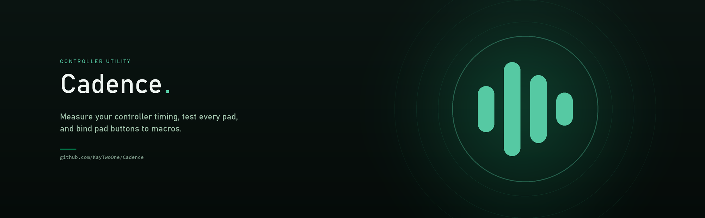

<div align="center">



**Measure controller timing, test every pad, and bind pad buttons to macros.**

[](https://github.com/KayTwoOne/Cadence/releases)
[](LICENSE)
[](https://github.com/KayTwoOne/Cadence/releases)

</div>

---

## See it running

<div align="center">

<!--
  Drop your ScreenToGif capture in as assets/showcase.gif and it appears here.
  Anything up to about 12 MB is fine; GitHub will not render a GIF over 10 MB inline
  on every connection, so aim under that. Around 900 px wide and 8-10 fps reads well.

  python showcase.py           walks the app through every feature on a timer
  python showcase.py --fast    same beats, roughly half the time
-->


</div>

---

## What it does

Cadence reads every controller attached to your machine and tells you three things:
how fast you are pressing, whether each pad is working properly, and what you want a
pad button to do besides what the game thinks it does.

### Timing

Press two buttons and the big number is the gap between them.

Underneath it sits the same gap in whole engine ticks. Games sample input at a fixed
rate, so two presses closer together than one tick reach the game at the same moment
and play out identically. Set the rate on the left to match whatever you are playing
and the column follows.

Every press goes into a log with its gap, tick count, hold time and stick direction.
The strip above the log draws recent presses to scale, so overlaps and hold lengths are
visible rather than something you work out from a table.

Set a target gap and Cadence tracks how many of your last 25 attempts landed inside it.
Hits tint amber, misses tint red.

### Controllers

All four slots at once. Each card shows what the device is, whether it is wired, its
battery if it has one, and every button lighting up as you press it.

It also measures how often your pad reports, which is the number that decides how much
of the timing you can trust.

### Macros

Bind a pad button to a stream of clicks or keypresses. Hold it or toggle it, fire at a
fixed rate or a random one, cap it by clicks or by seconds, click wherever the pointer
is or at a spot you picked earlier.

There is a button that types a known word into a box, so you can tell whether synthetic
input works on your machine before you point a macro at anything.

---

## Two things worth knowing

**Your controller sets the timing resolution, not this app.**

XInput hands back the last report the pad sent. Pads report every 4 to 8 ms, so reading
faster than that just re-reads the same packet. Cadence measures your pad's real report
rate and rounds every gap to what that supports, instead of printing decimals it cannot
back up.

Some pads send nothing at all while they sit still, which means the rate can only be
measured while a stick or trigger is moving. The Controllers tab has a button for that.

**Button names are a guess unless Cadence says otherwise.**

XInput reports every pad as an Xbox one, so the brand is recovered from the USB vendor
id. That fails in two ways worth knowing about: a pad running through DS4Windows or
Steam Input genuinely is a virtual Microsoft device, and with several pads attached
Windows does not say which slot is which. When detection is not certain the app says
so, and you can set the layout by hand.

---

## Stopping a macro

Three ways, because the output lands in whatever window you are looking at:

1. The **ARMED** switch in the app.
2. The **panic key**, F8 by default, which works when Cadence is not focused. If
   another app already owns that key, Cadence tells you rather than pretending.
3. Shoving the **mouse into a screen corner**.

Macros are disarmed every time the app starts. Nothing fires until you arm it.

---

## Installing

Grab the latest from [Releases](https://github.com/KayTwoOne/Cadence/releases).

| You want | Take |
|---|---|
| Installed properly, Start Menu, uninstaller | `Cadence-Setup-<version>-x64.exe` |
| Portable, no install | `Cadence.exe` |
| Debian, Ubuntu, Mint | `cadence_<version>_amd64.deb` |
| Any other Linux | `Cadence-<version>-linux-x64.tar.gz` into `/opt` |

Windows will warn about an unknown publisher, because the builds are not code signed.
Choose **More info**, then **Run anyway**, or build it yourself from source.

Cadence checks for newer releases on startup and offers to install them. Nothing
downloads until you click the prompt.

### Linux

Controllers are read through the kernel joystick interface, so your user needs to be in
the `input` group:

```bash
sudo usermod -aG input $USER
```

Log out and back in for that to take.

I develop on Windows and have not tested the Linux build on real hardware. If it
misbehaves, open an issue and say what pad you are on.

---

## Running from source

```bash
git clone https://github.com/KayTwoOne/Cadence
cd Cadence
python Cadence.py
```

Python 3.10 or newer. No third-party packages for the app itself; Pillow is only needed
if you want to regenerate the icon and banner.

```bash
python Cadence.py --demo        # two fake controllers, nothing to plug in
python Cadence.py --no-output   # macros count but send nothing
python showcase.py              # walks itself through every feature
python tests/run_all.py         # the test suites
```

---

## Building

```bash
pip install pyinstaller pillow
python packaging/build.py --installer
```

On Windows that wants [Inno Setup](https://jrsoftware.org/isdl.php) on PATH, or
installed in Program Files, for the installer step; without it you still get the
portable exe. On Linux it produces a tarball, and a `.deb` as well if `dpkg-deb` is
around.

Tagging a commit builds everything on GitHub Actions and publishes a release:

```bash
git tag v0.3.1
git push origin v0.3.1
```

---

## Ideas for later

Roughly in the order I would do them.

- [ ] **Save your setup.** Macros, targets and pad layouts vanish when you close the
      app. They should persist.
- [ ] **Macro profiles** you can switch between, and per-app ones that follow whatever
      is in the foreground.
- [ ] **Sequences, not just repeats.** Record a run of presses with their real timing
      and play it back.
- [ ] **Stick and trigger analysis.** Deadzone size, drift, how linear the triggers
      are, and a circularity test for the sticks.
- [ ] **Compare two sessions** so you can see whether a week of practice moved
      anything.
- [ ] **A proper end-to-end latency test** using a photodiode or a flashing region,
      measuring pad to photons rather than pad to app.
- [ ] **DualSense over Bluetooth** read directly, which would give real button names
      with no guessing.
- [ ] **Overlay mode**, a small always-on-top readout to keep beside another window.
- [ ] **Export on a timer** for long sessions.
- [ ] **Rebindable everything**, including the in-app shortcuts.
- [ ] **Signed builds**, so Windows stops warning about an unknown publisher.

Open an issue if you want one of these sooner, or if your pad does something strange.

---

## Licence

MIT, in [LICENSE](LICENSE). The installer also carries an
[end user agreement](packaging/EULA.txt) covering what the app does to your system,
and [third party notices](packaging/THIRD-PARTY-NOTICES.txt) for what is bundled.
